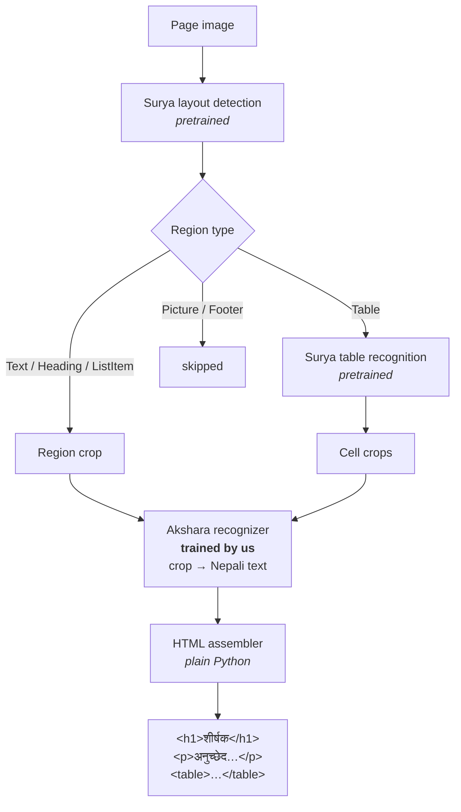
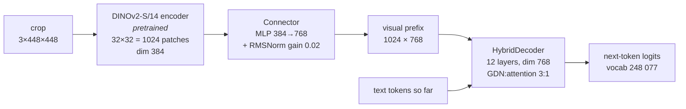
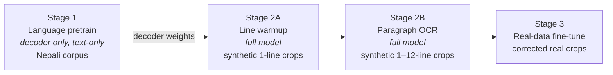

# Akshara (अक्षर) — Architecture

Nepali/Devanagari document OCR: **page image → structured HTML**.

Akshara composes pretrained, language-agnostic *structure* models with a
custom-trained Nepali *recognizer*. Structure (paragraphs, headings, tables)
is geometry — ruling lines, whitespace, alignment — and pretrained models
handle it out of the box. Reading Devanagari glyphs is the part that must be
trained, and it's the only part we train.

---

## 1. System overview



| Component | Model | Trained by us? |
|---|---|---|
| Layout detection | Surya layout | No — pretrained, language-agnostic |
| Reading order | Surya (with bbox-sort fallback) | No |
| Table structure | Surya table recognition | No |
| **Text recognition** | **Akshara recognizer** | **Yes** |
| HTML assembly | ~50 lines of Python (`src/pipeline.py`) | n/a (deterministic) |

**Why not one end-to-end page→HTML model?** We tried that design first.
At 448×448 a full A4 page gives each text line ~6–8 px — Devanagari matras
and conjuncts are simply not legible. Every model that makes full-page OCR
work (Nougat 896px, GOT-OCR 1024px, Pix2Struct 80M screenshots on 64 TPUs)
lives in a data/compute regime far beyond two Kaggle T4s. A *crop* resized
to 448px keeps lines at 20–50 px — fully legible — and the recognizer's job
shrinks to "read what you see."

---

## 2. The recognizer



### 2.1 Input preprocessing — aspect-preserving pad, never squash

Crops have wild aspect ratios (a line is 20:1, a table cell may be 1:2).
The image is resized so its longer side fits 448 px and pasted top-left onto
a **white** square canvas ("empty paper"). Squashing a line to a square makes
it unreadable; padding does not. Implemented in
`src/data/ocr_dataset.py::pad_to_square` — identical at train and inference.

*Upgrade path:* Pix2Struct-style variable-resolution input (scale each image
to a fixed *patch budget*, any grid shape). DINOv2's position embeddings
interpolate to any grid, so this needs no positional surgery — only batch
padding/masking. Do it when padding waste measurably hurts throughput.

### 2.2 Vision encoder — DINOv2-S/14, pretrained (~22 M params)

- `facebook/dinov2-small`, self-supervised on 142 M images, wrapped via
  `transformers.Dinov2Model` (~100-line wrapper in `src/models/vit.py`).
- 448×448 input → 14×14 patches → 32×32 = **1024 patch tokens**, dim 384.
  DINOv2's position embeddings interpolate to any grid
  (`interpolate_pos_encoding=True`), so the variable-resolution upgrade path
  survives. CLS token is dropped at output.
- **Why pretrained beats from-scratch here**: Donut/Nougat initialized from
  ImageNet Swin; Pix2Struct trained vision from scratch but with 80 M
  screenshots on 64 TPUs. On two T4s with synthetic crops, a pretrained
  encoder is the single highest-leverage choice in the system — it already
  knows edges, strokes and paper texture; training only teaches it
  Devanagari. (Surya 2's card doesn't disclose its encoder init, so it
  offers no counter-evidence.)
- DINOv2 uses the same ImageNet mean/std normalization as our datasets.
- Budget check: 1024 visual + 512 text = 1536 = 3 × `max_seq_len` — exactly
  what the decoder's RoPE tables and causal mask are sized for.

### 2.3 Connector (~0.9 M params)

Two-layer MLP (384 → 768 → 768, GELU) followed by an **RMSNorm with gain
initialized to 0.02**. Token embeddings have per-dim std 0.02; without this
norm the visual prefix enters the residual stream ~5× hotter than text and
drowns it out early in training.

### 2.4 HybridDecoder (~273 M params, 190 M of which is the embedding table)

12 layers alternating **Gated DeltaNet (GDN)** and full attention, 3:1
(`attn_every=4` → layers 3, 7, 11 are attention):

- **GDN layers** (9): O(T) recurrence with a per-head memory matrix
  `S ← α·S + β·(v − S·k)kᵀ` — erase-then-write associative memory.
  - Forget gate α uses `bias=+4` init → `sigmoid(4)≈0.98` — memory survives
    ~50 tokens at init instead of halving every step.
  - Recurrence runs in **fp32** even under bf16 autocast: the delta rule
    relies on near-cancellation `v − S·k`, which bf16's 8-bit mantissa
    destroys over hundreds of steps.
  - Known bottleneck: the recurrence is a Python loop over T. For serious
    Stage-2 throughput, swap in the FLA chunked Triton kernel
    (`fla.ops.gated_delta_rule`).
- **Attention layers** (3): exact-recall checkpoints. GQA 12 query / 3 KV
  heads, RoPE (real cos/sin tables — complex tensors break DataParallel
  buffer replication). Tables sized `max_seq_len × 3` to cover the 1024-token
  visual prefix + text.
- Weight-tied embedding/LM head; depth-scaled init (`0.02/√(2·n_layers)`)
  on residual output projections.
- Loss: cross-entropy with `ignore_index=-100`. Datasets mark every target
  position after the first EOS as −100 — otherwise ~80 % of supervised
  positions are "predict EOS given EOS" and the model learns to emit empty
  pages.

### 2.5 Tokenizer

`Qwen/Qwen3.5-0.8B` — multilingual BPE, handles Devanagari well.
`len(tokenizer)` = **248 077** (the single source of truth for `vocab_size`;
`bos_token_id` is `None`, so EOS doubles as the BOS sentinel everywhere).
The 190 M-parameter embedding table is the price of this vocabulary; a
trimmed Nepali-focused vocab is a possible future optimization.

---

## 3. Training curriculum



| Stage | Script | Data | Learns |
|---|---|---|---|
| 1 | `scripts/pretrain.py` | Nepali text (Wikipedia / CulturaX) | grammar, script, vocabulary |
| 2A | `scripts/train_ocr.py` | synthetic single-line crops | glyph recognition (conjuncts, matras) |
| 2B | `scripts/train_ocr.py` | synthetic multi-line crops | multi-line reading, layout robustness |
| 3 | `scripts/train_ocr.py` | real corrected crops | domain adaptation |

**Why lines before paragraphs (2A → 2B):** Pix2Struct
([arXiv:2210.03347](https://arxiv.org/abs/2210.03347)) showed that a
"warmup" stage of simply *learning to read* rendered text snippets makes
pretraining stabler, faster-converging, and better at fine-tuning time
(−11.6 ANLS on DocVQA without it). Our 2A is exactly that warmup, with
Nepali fonts.

**The two phases are one generator knob.** Line crops render on the same
448 canvas as paragraphs (random vertical position = free augmentation);
2B just raises `max_lines` from 1 to ~12. Same model, same input geometry,
no positional surgery between phases.

**What we deliberately do NOT copy from Pix2Struct:** its 50 % text masking.
Predicting invisible text is the point for visual language understanding —
for faithful OCR it explicitly trains hallucination. The recognizer is only
ever supervised on visible text.

**Stage 2 warm-start:** decoder loads Stage-1 weights; vision encoder +
connector start random. The encoder is frozen for the first ~1 000 steps so
random vision gradients don't wreck the pretrained language weights.

---

## 4. Data formats

**Stage 1 (text):** JSONL, one object per line
```json
{"text": "नेपाली पाठ यहाँ छ"}
```

**Stages 2–3 (crops):** JSONL, one object per line
```json
{"image": "crops/000123.png", "text": "यो एक हरफ हो"}
```
- `image` paths absolute or relative to the JSONL file
- `image_path` / `html` accepted as legacy aliases
- targets are **plain text** — no HTML tags. Structure comes from the
  layout model at inference, never from the recognizer.

Sequence construction (`CropOCRDataset`):
```
input   = [BOS] t₁ … tₙ [EOS] [EOS] … [EOS]   ← pad with EOS (embeddable)
target  =  t₁ … tₙ [EOS] [-100] … [-100]       ← pad with -100 (loss-masked)
```

---

## 5. Repository map

```
akshara/
├── config/config.py          # dataclass configs (vocab 248077, seq 512, img 448)
├── configs/*.json             # per-stage overrides
├── scripts/
│   ├── pretrain.py            # Stage 1 (text-only LM)
│   ├── train_ocr.py           # Stages 2A/2B/3 (crop OCR)
│   ├── generate.py            # single-image inference
│   └── prepare_data.py        # corpus/dataset download
├── src/
│   ├── models/
│   │   ├── vit.py             # DINOv2-S/14 wrapper (pretrained)
│   │   ├── connector.py       # MLP bridge + scale-matching RMSNorm
│   │   ├── hybrid_decoder.py  # 3:1 GDN/attention decoder
│   │   ├── gdn_block.py       # Gated DeltaNet (fp32 recurrence)
│   │   ├── attention.py       # GQA + RoPE
│   │   ├── rope.py            # real cos/sin tables
│   │   └── vlm.py             # Akshara = encoder+connector+decoder
│   ├── data/
│   │   ├── text_dataset.py    # Stage 1 JSONL
│   │   ├── ocr_dataset.py     # CropOCRDataset, pad_to_square
│   │   └── synth_data.py      # synthetic crop generator (being rewritten)
│   └── pipeline.py            # Surya layout → recognizer → HTML
└── kaggle_run.py              # Kaggle kernel entry point
```

---

## 6. Hardware & known limits

- **Target:** Kaggle T4 ×2 (2×16 GB), `nn.DataParallel`, bf16 autocast,
  gradient checkpointing. Model returns loss inside `forward`, so training
  scripts call `loss.mean()` (DataParallel gathers one loss per GPU).
- **Throughput ceiling:** the GDN Python loop runs 1024+512 sequential steps
  per layer per forward. Fine for smoke tests and Stage 1 (text-only, 512
  steps); swap in FLA's Triton kernel before long Stage-2 runs.
- **No KV cache yet:** `generate()` re-runs the decoder over the full prefix
  per token (image is encoded once). Acceptable for eval at `max_new≤256`;
  a KV/state cache is the biggest inference-speed win available.
- **Surya API drift:** `src/pipeline.py` imports surya lazily and pins
  loosely; check `surya-ocr` version if layout calls break.
